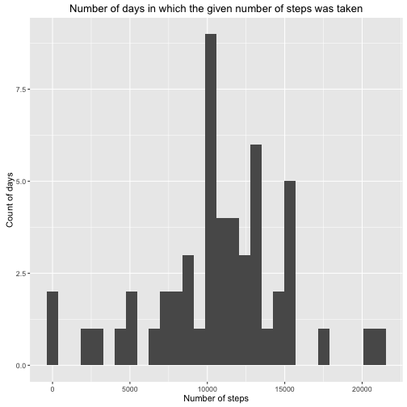
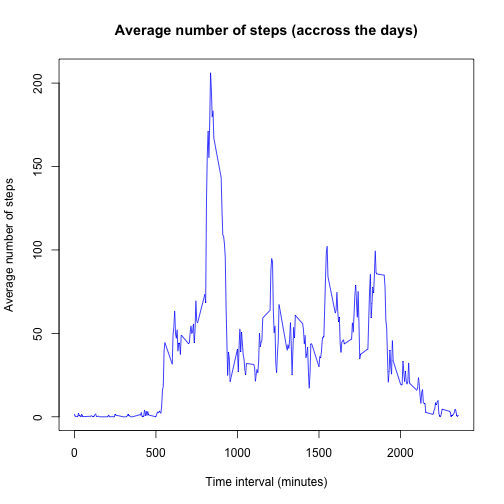
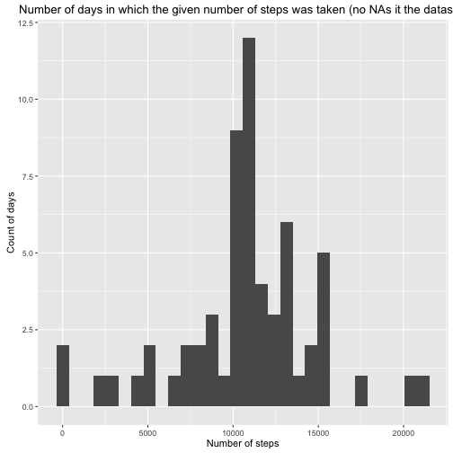

#Personal Movement Data Analysis
###Assignment: Course Project 1
______________

##Loading and preprocessing the data

Loading the data  

```r
Data<-read.csv(file = "activity.csv")
```

______________
##What is mean total number of steps taken per day?
 
1. Calculating the total number of steps taken per day


```r
library(dplyr)
grouped_by_day<-group_by(Data, date)
steps_per_day<-summarize(grouped_by_day, steps_per_day=sum(steps))
```

2. Making the table presenting the total number of steps taken per day

```r
library(xtable)
xt1<-xtable(steps_per_day)
print(xt1, type = "html")
```

<!-- html table generated in R 3.3.0 by xtable 1.8-2 package -->
<!-- Sun Jun  5 16:11:28 2016 -->
<table border=1>
<tr> <th>  </th> <th> date </th> <th> steps_per_day </th>  </tr>
  <tr> <td align="right"> 1 </td> <td> 2012-10-01 </td> <td align="right">  </td> </tr>
  <tr> <td align="right"> 2 </td> <td> 2012-10-02 </td> <td align="right"> 126 </td> </tr>
  <tr> <td align="right"> 3 </td> <td> 2012-10-03 </td> <td align="right"> 11352 </td> </tr>
  <tr> <td align="right"> 4 </td> <td> 2012-10-04 </td> <td align="right"> 12116 </td> </tr>
  <tr> <td align="right"> 5 </td> <td> 2012-10-05 </td> <td align="right"> 13294 </td> </tr>
  <tr> <td align="right"> 6 </td> <td> 2012-10-06 </td> <td align="right"> 15420 </td> </tr>
  <tr> <td align="right"> 7 </td> <td> 2012-10-07 </td> <td align="right"> 11015 </td> </tr>
  <tr> <td align="right"> 8 </td> <td> 2012-10-08 </td> <td align="right">  </td> </tr>
  <tr> <td align="right"> 9 </td> <td> 2012-10-09 </td> <td align="right"> 12811 </td> </tr>
  <tr> <td align="right"> 10 </td> <td> 2012-10-10 </td> <td align="right"> 9900 </td> </tr>
  <tr> <td align="right"> 11 </td> <td> 2012-10-11 </td> <td align="right"> 10304 </td> </tr>
  <tr> <td align="right"> 12 </td> <td> 2012-10-12 </td> <td align="right"> 17382 </td> </tr>
  <tr> <td align="right"> 13 </td> <td> 2012-10-13 </td> <td align="right"> 12426 </td> </tr>
  <tr> <td align="right"> 14 </td> <td> 2012-10-14 </td> <td align="right"> 15098 </td> </tr>
  <tr> <td align="right"> 15 </td> <td> 2012-10-15 </td> <td align="right"> 10139 </td> </tr>
  <tr> <td align="right"> 16 </td> <td> 2012-10-16 </td> <td align="right"> 15084 </td> </tr>
  <tr> <td align="right"> 17 </td> <td> 2012-10-17 </td> <td align="right"> 13452 </td> </tr>
  <tr> <td align="right"> 18 </td> <td> 2012-10-18 </td> <td align="right"> 10056 </td> </tr>
  <tr> <td align="right"> 19 </td> <td> 2012-10-19 </td> <td align="right"> 11829 </td> </tr>
  <tr> <td align="right"> 20 </td> <td> 2012-10-20 </td> <td align="right"> 10395 </td> </tr>
  <tr> <td align="right"> 21 </td> <td> 2012-10-21 </td> <td align="right"> 8821 </td> </tr>
  <tr> <td align="right"> 22 </td> <td> 2012-10-22 </td> <td align="right"> 13460 </td> </tr>
  <tr> <td align="right"> 23 </td> <td> 2012-10-23 </td> <td align="right"> 8918 </td> </tr>
  <tr> <td align="right"> 24 </td> <td> 2012-10-24 </td> <td align="right"> 8355 </td> </tr>
  <tr> <td align="right"> 25 </td> <td> 2012-10-25 </td> <td align="right"> 2492 </td> </tr>
  <tr> <td align="right"> 26 </td> <td> 2012-10-26 </td> <td align="right"> 6778 </td> </tr>
  <tr> <td align="right"> 27 </td> <td> 2012-10-27 </td> <td align="right"> 10119 </td> </tr>
  <tr> <td align="right"> 28 </td> <td> 2012-10-28 </td> <td align="right"> 11458 </td> </tr>
  <tr> <td align="right"> 29 </td> <td> 2012-10-29 </td> <td align="right"> 5018 </td> </tr>
  <tr> <td align="right"> 30 </td> <td> 2012-10-30 </td> <td align="right"> 9819 </td> </tr>
  <tr> <td align="right"> 31 </td> <td> 2012-10-31 </td> <td align="right"> 15414 </td> </tr>
  <tr> <td align="right"> 32 </td> <td> 2012-11-01 </td> <td align="right">  </td> </tr>
  <tr> <td align="right"> 33 </td> <td> 2012-11-02 </td> <td align="right"> 10600 </td> </tr>
  <tr> <td align="right"> 34 </td> <td> 2012-11-03 </td> <td align="right"> 10571 </td> </tr>
  <tr> <td align="right"> 35 </td> <td> 2012-11-04 </td> <td align="right">  </td> </tr>
  <tr> <td align="right"> 36 </td> <td> 2012-11-05 </td> <td align="right"> 10439 </td> </tr>
  <tr> <td align="right"> 37 </td> <td> 2012-11-06 </td> <td align="right"> 8334 </td> </tr>
  <tr> <td align="right"> 38 </td> <td> 2012-11-07 </td> <td align="right"> 12883 </td> </tr>
  <tr> <td align="right"> 39 </td> <td> 2012-11-08 </td> <td align="right"> 3219 </td> </tr>
  <tr> <td align="right"> 40 </td> <td> 2012-11-09 </td> <td align="right">  </td> </tr>
  <tr> <td align="right"> 41 </td> <td> 2012-11-10 </td> <td align="right">  </td> </tr>
  <tr> <td align="right"> 42 </td> <td> 2012-11-11 </td> <td align="right"> 12608 </td> </tr>
  <tr> <td align="right"> 43 </td> <td> 2012-11-12 </td> <td align="right"> 10765 </td> </tr>
  <tr> <td align="right"> 44 </td> <td> 2012-11-13 </td> <td align="right"> 7336 </td> </tr>
  <tr> <td align="right"> 45 </td> <td> 2012-11-14 </td> <td align="right">  </td> </tr>
  <tr> <td align="right"> 46 </td> <td> 2012-11-15 </td> <td align="right">  41 </td> </tr>
  <tr> <td align="right"> 47 </td> <td> 2012-11-16 </td> <td align="right"> 5441 </td> </tr>
  <tr> <td align="right"> 48 </td> <td> 2012-11-17 </td> <td align="right"> 14339 </td> </tr>
  <tr> <td align="right"> 49 </td> <td> 2012-11-18 </td> <td align="right"> 15110 </td> </tr>
  <tr> <td align="right"> 50 </td> <td> 2012-11-19 </td> <td align="right"> 8841 </td> </tr>
  <tr> <td align="right"> 51 </td> <td> 2012-11-20 </td> <td align="right"> 4472 </td> </tr>
  <tr> <td align="right"> 52 </td> <td> 2012-11-21 </td> <td align="right"> 12787 </td> </tr>
  <tr> <td align="right"> 53 </td> <td> 2012-11-22 </td> <td align="right"> 20427 </td> </tr>
  <tr> <td align="right"> 54 </td> <td> 2012-11-23 </td> <td align="right"> 21194 </td> </tr>
  <tr> <td align="right"> 55 </td> <td> 2012-11-24 </td> <td align="right"> 14478 </td> </tr>
  <tr> <td align="right"> 56 </td> <td> 2012-11-25 </td> <td align="right"> 11834 </td> </tr>
  <tr> <td align="right"> 57 </td> <td> 2012-11-26 </td> <td align="right"> 11162 </td> </tr>
  <tr> <td align="right"> 58 </td> <td> 2012-11-27 </td> <td align="right"> 13646 </td> </tr>
  <tr> <td align="right"> 59 </td> <td> 2012-11-28 </td> <td align="right"> 10183 </td> </tr>
  <tr> <td align="right"> 60 </td> <td> 2012-11-29 </td> <td align="right"> 7047 </td> </tr>
  <tr> <td align="right"> 61 </td> <td> 2012-11-30 </td> <td align="right">  </td> </tr>
   </table>

3. Making the histogram of the number of days with the given number of steps per day

```r
library(ggplot2)
plot1<-ggplot(steps_per_day, aes(steps_per_day))+geom_histogram()+labs(title="Number of days in which the given number of steps was taken")+labs(x="Number of steps", y="Count of days")
print(plot1)
```



4. Calculating and reporting the mean and median of the total number of steps taken per day

```r
Mean<-mean(steps_per_day$steps_per_day, na.rm = TRUE)
Median<-median(steps_per_day$steps_per_day, na.rm = TRUE)
```
The mean of the total number of stepts per day is **1.0766189 &times; 10<sup>4</sup>** and the median is **10765**.


##What is the average daily activity pattern?

1. Calculating avarage number of steps per interval (averaged accross all days)

```r
grouped_by_interval<-group_by(Data, interval)
steps_per_interval<-summarize(grouped_by_interval, mean_steps_per_interval=mean(steps, na.rm = TRUE))
```

2. Making a time series plot


```r
plot2<-with(steps_per_interval, plot.ts(interval, mean_steps_per_interval, 
                                 type="l", 
                                 col="blue",
                                 main = "Average number of steps (accross the days)",
                                 xlab="Time interval (minutes)",
                                 ylab="Average number of steps"))
```



```r
print(plot2)
```

```
## NULL
```

3. Indicating 5-minute interval with maximum nuber of steps (average accross all the days)


```r
interval_max<-which(steps_per_interval$mean_steps_per_interval==max(steps_per_interval$mean_steps_per_interval))
interval_max<-steps_per_interval[interval_max, 1]
```
Interval with maximum average (accross all days) number of steps is **835**.

##Imputing missing values

1. Counting NAs

```r
NA_count<-sum(is.na(Data))
```
The number of missing values in the dataset is **2304**.

2. Filling in missing values with the mean of steps (accross all the days) of 5-minute intervals

```r
impData<-Data
for (i in (1:nrow(impData))) {
        if (is.na(impData$steps[i])){
                impData$steps[i]<-steps_per_interval[(which(steps_per_interval$interval==impData$interval[i])),]$mean_steps_per_interval
        }
}
```

3. Chacking if all missing values are filled in

```r
number_of_NAs<-sum(is.na(impData))
```
Now the number of missing data in dataset is **0**.


4. Calculating the total number of steps taken per day in the dataset without missing data


```r
imp_grouped_by_day<-group_by(impData, date)
imp_steps_per_day<-summarize(imp_grouped_by_day, steps_per_day=sum(steps))
```
5. Making a histogram of the total number of steps taken each day

```r
plot3<-ggplot(imp_steps_per_day, aes(steps_per_day))+geom_histogram()+labs(title="Number of days in which the given number of steps was taken (no NAs it the dataset)")+labs(x="Number of steps", y="Count of days")
print(plot3)
```



6. Calculating and reporting the mean and median of the total number of steps taken per day in the dataset without missing values

```r
impMean<-mean(imp_steps_per_day$steps_per_day, na.rm = TRUE)
impMedian<-median(imp_steps_per_day$steps_per_day, na.rm = TRUE)
```
The mean of the total number of stepts per day in the dataset without missing values is **1.0766189 &times; 10<sup>4</sup>** and the median is **1.0766189 &times; 10<sup>4</sup>**. That means that filling in the missing values had **almost no impact** on the mean and the median, i.e. mean changed by **0** and median by **1.1886792**.

##Are there differences in activity patterns between weekdays and weekends?

1. Creating a new factor variable indicating whether a given date is a weekday or weekend day.

```r
impData$day<-factor(weekdays(as.Date(impData$date)))
levels(impData$day)<-list("weekday"=c("poniedziałek", "wtorek", "środa", "czwartek", "piątek"),"weekend"=c("sobota", "niedziela"))
```

2. Calculating the mean of steps per interval for weekdays and weekned days (dataset with NAs filled in)

```r
impData_gruped_by_interval_and_day<-group_by(impData, interval, day)
mean_steps<-summarize(impData_gruped_by_interval_and_day, mean=mean(steps))
```

3. Making the time series plot with panels for weekdays and weekend days

```r
library(lattice)
plot4<-xyplot(mean~interval| day, data=mean_steps, 
       type="l", 
       layout=c(1,2), 
       xlab="Interval", 
       ylab="Number of steps")
print(plot4)
```


